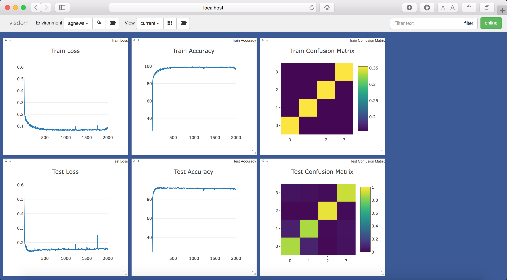
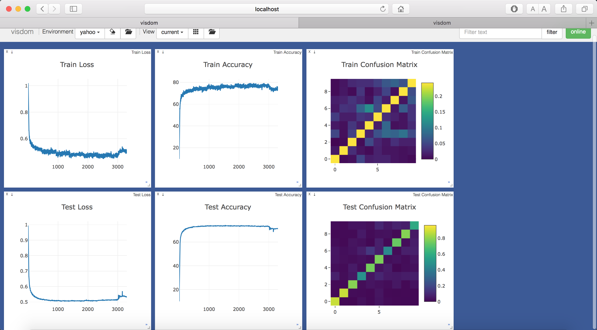
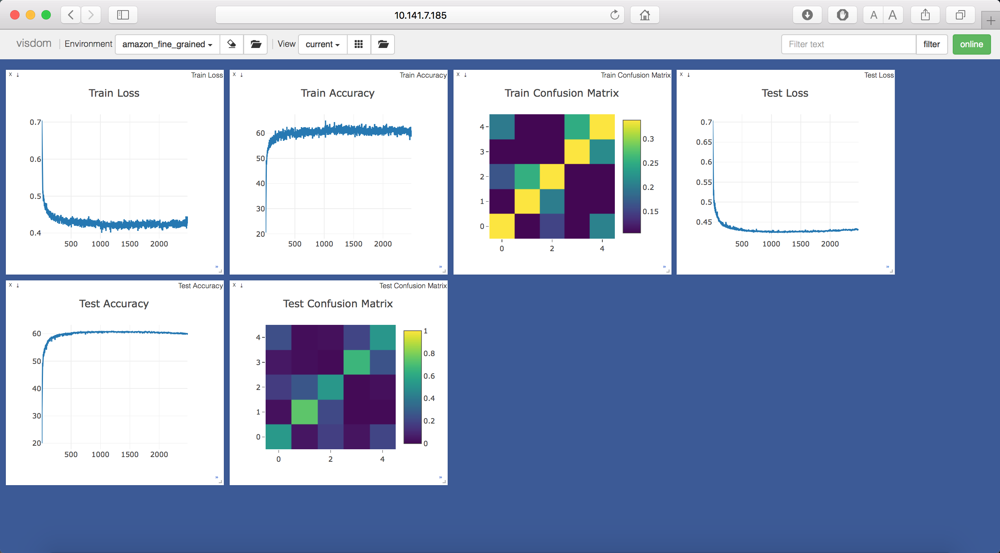

# CCCapsNet
A PyTorch implementation of Compositional coding Capsule Network based on the paper [Compositional coding capsule network with k-means routing for text classification](https://arxiv.org/abs/1810.09177).

## Requirements
* [Anaconda](https://www.anaconda.com/download/)
* PyTorch
```
conda install pytorch torchvision -c pytorch
```
* PyTorchNet
```
pip install git+https://github.com/pytorch/tnt.git@master
```
* PyTorch-NLP
```
pip install pytorch-nlp
```
* capsule-layer
```
pip install git+https://github.com/leftthomas/CapsuleLayer.git@master
```

## Datasets
The original `AGNews`, `AmazonReview`, `DBPedia`, `YahooAnswers`, `SogouNews` and `YelpReview` datasets are coming from [here](http://goo.gl/JyCnZq).

The original `Newsgroups`, `Reuters`, `Cade` and `WebKB` datasets can be found [here](http://ana.cachopo.org/datasets-for-single-label-text-categorization).

The original `IMDB` dataset is downloaded by `PyTorch-NLP` automatically.

We have uploaded all the original datasets into [BaiduYun](https://pan.baidu.com/s/16wBuNJiD0acgTHDeld9eDA)(access code:kddr) and 
[GoogleDrive](https://drive.google.com/open?id=10n_eZ2ZyRjhRWFjxky7_PhcGHecDjKJ2). 
The preprocessed datasets have been uploaded to [BaiduYun](https://pan.baidu.com/s/1hsIJAw54YZbVAqFiehEH6w)(access code:2kyd) and 
[GoogleDrive](https://drive.google.com/open?id=1KDE5NJKfgOwc6RNEf9_F0ZhLQZ3Udjx5).

You needn't download the datasets by yourself, the code will download them automatically.
If you encounter network issues, you can download all the datasets from the aforementioned cloud storage webs, 
and extract them into `data` directory.

## Usage

### Generate Preprocessed Data
```
python utils.py --data_type yelp --fine_grained
optional arguments:
--data_type              dataset type [default value is 'imdb'](choices:['imdb', 'newsgroups', 'reuters', 'webkb', 
                         'cade', 'dbpedia', 'agnews', 'yahoo', 'sogou', 'yelp', 'amazon'])
--fine_grained           use fine grained class or not, it only works for reuters, yelp and amazon [default value is False]
```
This step is not required, and it takes a long time to execute. So I have generated the preprocessed data before, and 
uploaded them to the aforementioned cloud storage webs. You could skip this step, and just do the next step, the code will 
download the data automatically.

### Train Text Classification
```
visdom -logging_level WARNING & python main.py --data_type newsgroups --num_epochs 70
optional arguments:
--data_type              dataset type [default value is 'imdb'](choices:['imdb', 'newsgroups', 'reuters', 'webkb', 
                         'cade', 'dbpedia', 'agnews', 'yahoo', 'sogou', 'yelp', 'amazon'])
--fine_grained           use fine grained class or not, it only works for reuters, yelp and amazon [default value is False]
--text_length            the number of words about the text to load [default value is 5000]
--routing_type           routing type, it only works for capsule classifier [default value is 'k_means'](choices:['k_means', 'dynamic'])
--loss_type              loss type [default value is 'mf'](choices:['margin', 'focal', 'cross', 'mf', 'mc', 'fc', 'mfc'])
--embedding_type         embedding type [default value is 'cwc'](choices:['cwc', 'cc', 'normal'])
--classifier_type        classifier type [default value is 'capsule'](choices:['capsule', 'linear'])
--embedding_size         embedding size [default value is 64]
--num_codebook           codebook number, it only works for cwc and cc embedding [default value is 8]
--num_codeword           codeword number, it only works for cwc and cc embedding [default value is None]
--hidden_size            hidden size [default value is 128]
--in_length              in capsule length, it only works for capsule classifier [default value is 8]
--out_length             out capsule length, it only works for capsule classifier [default value is 16]
--num_iterations         routing iterations number, it only works for capsule classifier [default value is 3]
--num_repeat             gumbel softmax repeat number, it only works for cc embedding [default value is 10]
--drop_out               drop_out rate of GRU layer [default value is 0.5]
--batch_size             train batch size [default value is 32]
--num_epochs             train epochs number [default value is 30]
--num_steps              test steps number [default value is 100]
```
Visdom now can be accessed by going to `127.0.0.1:8097/env/$data_type` in your browser, `$data_type` means the dataset 
type which you are training.

## Benchmarks
Adam optimizer is used with learning rate scheduling. The models are trained with 10 epochs and batch size of 32 on one 
NVIDIA Tesla V100 (32G) GPU.

The texts are preprocessed as only number and English words, max length is 5000.

Here is the dataset details:

<table>
  <thead>
    <tr>
      <th>Dataset</th>
      <th>agnews</th>
      <th>dbpedia</th>
      <th>yahoo</th>
      <th>sogou</th>
      <th>yelp</th>
      <th>yelp fine grained</th>
      <th>amazon</th>
      <th>amazon fine grained</th>
    </tr>
  </thead>
  <tbody>
    <tr>
      <td align="center">Num. of Train Texts</td>
      <td align="center">120,000</td>
      <td align="center">560,000</td>
      <td align="center">1,400,000</td>
      <td align="center">450,000</td>
      <td align="center">560,000</td>
      <td align="center">650,000</td>
      <td align="center">3,600,000</td>
      <td align="center">3,000,000</td>
    </tr>
    <tr>
      <td align="center">Num. of Test Texts</td>
      <td align="center">7,600</td>
      <td align="center">70,000</td>
      <td align="center">60,000</td>
      <td align="center">60,000</td>
      <td align="center">38,000</td>
      <td align="center">50,000</td>
      <td align="center">400,000</td>
      <td align="center">650,000</td>
    </tr>
    <tr>
      <td align="center">Num. of Vocabulary</td>
      <td align="center">62,535</td>
      <td align="center">548,338</td>
      <td align="center">771,820</td>
      <td align="center">106,385</td>
      <td align="center">200,790</td>
      <td align="center">216,985</td>
      <td align="center">931,271</td>
      <td align="center">835,818</td>
    </tr>
    <tr>
      <td align="center">Num. of Classes</td>
      <td align="center">4</td>
      <td align="center">14</td>
      <td align="center">10</td>
      <td align="center">5</td>
      <td align="center">2</td>
      <td align="center">5</td>
      <td align="center">2</td>
      <td align="center">5</td>
    </tr>
  </tbody>
</table>

Here is the model parameter details:

<table>
  <thead>
    <tr>
      <th>Dataset</th>
      <th>agnews</th>
      <th>dbpedia</th>
      <th>yahoo</th>
      <th>sogou</th>
      <th>yelp</th>
      <th>yelp fine grained</th>
      <th>amazon</th>
      <th>amazon fine grained</th>
    </tr>
  </thead>
  <tbody>
    <tr>
      <td align="center">Normal-Linear</td>
      <td align="center">4,448,192</td>
      <td align="center">35,540,864</td>
      <td align="center">49,843,200</td>
      <td align="center">7,254,720</td>
      <td align="center">13,296,256</td>
      <td align="center">14,333,120</td>
      <td align="center">60,047,040</td>
      <td align="center">53,938,432</td>
    </tr>
    <tr>
      <td align="center">CC-Linear</td>
      <td align="center">2,449,120</td>
      <td align="center">26,770,528</td>
      <td align="center">37,497,152</td>
      <td align="center">4,704,040</td>
      <td align="center">8,479,856</td>
      <td align="center">9,128,040</td>
      <td align="center">45,149,776</td>
      <td align="center">40,568,416</td>
    </tr>
    <tr>
      <td align="center">CWC-Linear</td>
      <td align="center">2,449,120</td>
      <td align="center">26,770,528</td>
      <td align="center">37,497,152</td>
      <td align="center">4,704,040</td>
      <td align="center">8,479,856</td>
      <td align="center">9,128,040</td>
      <td align="center">45,149,776</td>
      <td align="center">40,568,416</td>
    </tr>
    <tr>
      <td align="center">Normal-Capsule</td>
      <td align="center">4,455,872</td>
      <td align="center">35,567,744</td>
      <td align="center">49,862,400</td>
      <td align="center">7,264,320</td>
      <td align="center">13,300,096</td>
      <td align="center">14,342,720</td>
      <td align="center">60,050,880</td>
      <td align="center">53,948,032</td>
    </tr>
    <tr>
      <td align="center">CC-Capsule</td>
      <td align="center">2,456,800</td>
      <td align="center">26,797,408</td>
      <td align="center">37,516,352</td>
      <td align="center">4,713,640</td>
      <td align="center">8,483,696</td>
      <td align="center">9,137,640</td>
      <td align="center">45,153,616</td>
      <td align="center">40,578,016</td>
    </tr>
    <tr>
      <td align="center">CWC-Capsule</td>
      <td align="center">2,456,800</td>
      <td align="center">26,797,408</td>
      <td align="center">37,516,352</td>
      <td align="center">4,713,640</td>
      <td align="center">8,483,696</td>
      <td align="center">9,137,640</td>
      <td align="center">45,153,616</td>
      <td align="center">40,578,016</td>
    </tr>
  </tbody>
</table>

Here is the loss function details, we use `AGNews` dataset to test different loss functions:

<table>
  <thead>
    <tr>
      <th>Loss Function</th>
      <th>margin</th>
      <th>focal</th>
      <th>cross</th>
      <th>margin+focal</th>
      <th>margin+cross</th>
      <th>focal+cross</th>
      <th>margin+focal+cross</th>
    </tr>
  </thead>
  <tbody>
    <tr>
      <td align="center">Accuracy</td>
      <td align="center">92.37%</td>
      <td align="center">92.13%</td>
      <td align="center">92.05%</td>
      <td align="center">92.64%</td>
      <td align="center">91.95%</td>
      <td align="center">92.09%</td>
      <td align="center">92.38%</td>
    </tr>
  </tbody>
</table>

Here is the accuracy details, we use `margin+focal` as our loss function:

<table>
  <thead>
    <tr>
      <th>Dataset</th>
      <th>agnews</th>
      <th>dbpedia</th>
      <th>yahoo</th>
      <th>sogou</th>
      <th>yelp</th>
      <th>yelp fine grained</th>
      <th>amazon</th>
      <th>amazon fine grained</th>
    </tr>
  </thead>
  <tbody>
    <tr>
      <td align="center">Normal-Linear</td>
      <td align="center">92.64%</td>
      <td align="center">98.84%</td>
      <td align="center">74.13%</td>
      <td align="center">97.37%</td>
      <td align="center">96.69%</td>
      <td align="center">66.23%</td>
      <td align="center">95.09%</td>
      <td align="center">60.78%</td>
    </tr>
    <tr>
      <td align="center">CC-Linear</td>
      <td align="center">73.11%</td>
      <td align="center">92.66%</td>
      <td align="center">48.01%</td>
      <td align="center">94.10%</td>
      <td align="center">87.81%</td>
      <td align="center">52.65%</td>
      <td align="center">82.25%</td>
      <td align="center">45.08%</td>
    </tr>
    <tr>
      <td align="center">CWC-Linear</td>
      <td align="center">91.93%</td>
      <td align="center">98.83%</td>
      <td align="center">73.58%</td>
      <td align="center">96.08%</td>
      <td align="center">96.35%</td>
      <td align="center">64.29%</td>
      <td align="center">93.65%</td>
      <td align="center">57.21%</td>
    </tr>
    <tr>
      <td align="center">Normal-Capsule</td>
      <td align="center">92.18%</td>
      <td align="center">98.86%</td>
      <td align="center">74.12%</td>
      <td align="center">101</td>
      <td align="center">96.56%</td>
      <td align="center">600</td>
      <td align="center">101</td>
      <td align="center">51</td>
    </tr>
    <tr>
      <td align="center">CC-Capsule</td>
      <td align="center">73.53%</td>
      <td align="center">93.04%</td>
      <td align="center">50.52%</td>
      <td align="center">9,537</td>
      <td align="center">87.98%</td>
      <td align="center">4,110</td>
      <td align="center">9,537</td>
      <td align="center">3,570</td>
    </tr>
    <tr>
      <td align="center">CWC-Capsule</td>
      <td align="center">92.12%</td>
      <td align="center">98.81%</td>
      <td align="center">73.78%</td>
      <td align="center">3,783</td>
      <td align="center">96.28%</td>
      <td align="center">4,110</td>
      <td align="center">3,783</td>
      <td align="center">1,530</td>
    </tr>
  </tbody>
</table>

## Results
The train/test loss、accuracy and confusion matrix are showed with visdom. The pretrained models and more results can be 
found in [BaiduYun](https://pan.baidu.com/s/1mpIXTfuECiSFVxJcLR1j3A) (access code:xer4) and 
[GoogleDrive](https://drive.google.com/drive/folders/1AsP9irE1tQisK2H_nLHJERqxMro_mRUb?usp=sharing).

**agnews**



**dbpedia**


**yahoo**



**sogou**


**yelp**


**yelp fine grained**


**amazon**


**amazon fine grained**


